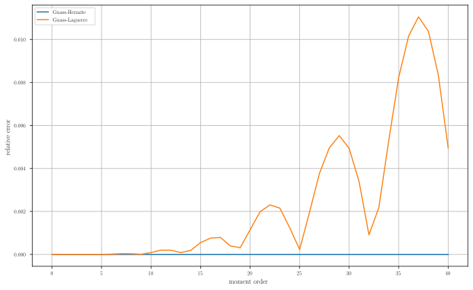

Lightweight Numerical Integration Tools (LNIT)
Some basic tools for numrrical integration

# Integration over infinie/semi-infinite domain

We want to compute the following integral:
\f$\int_{a}^{\infty} f(x)\,\mathrm{d}x\f$ or\f$\int_{-\infty}^{a} f(x)\,\mathrm{d}x\f$.

We can use Gauss-Laguerre quadrature. 
```cpp
const auto f = [mu, sigma, k](const Scalar x) -> Scalar
{
  return std::pow(x, k)*(1 / (sigma*std::sqrt(2*M_PI)))*std::exp(-(x-mu)*(x-mu) / (2*sigma*sigma));
};

LNIT::GaussLaguerreQuadrature<Scalar> quadLaguerre;
quadLaguerre.integrateRightInfinite(f, a); // \f$\int_{a}^{\infty} f(x)\,\mathrm{d}x\f$
quadLaguerre.integrateLeftInfinite(f, a); // \f$\int_{-\infty}^{a} f(x)\,\mathrm{d}x\f$
```
As for now, the Gauss-Laguerre quadrature is only implemented with 33 nodes.

Now if we want to integrate over \f$ \mathbb{R} \f$, we could simply do
```cpp
const Scalar I = quadLaguerre.integrateRightInfinite(f, a) + quadLaguerre.integrateLeftInfinite(f, a);
```
Or we could use Gauss-Hermite quadrature:
```cpp
LNIT::GaussHermiteQuadrature<Scalar> quadHermite;
const Scalar hermiteEstimated  = quadHermite.integrate(f);
```
As for now, the Gauss-Hermite quadrature is only implemented with 66 nodes.

Since both quadratures integrate over \f$ \mathbb{R} \f$ with the same number of nodes, we could assume both are equaly accurate.
We compare how both methods integrate the first 40 moments of a Gaussian distribution (\f$\sigma = 1\f$ and \f$\mu = \frac{1}{2}\f$). 
We show, the relative error committed by both Gauss-Laguerre and Gauss-Hermite quadratures and observe that Gauss-Hermite is much more accurate. 

<p align="center">
  
</p>
