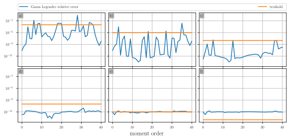
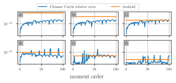
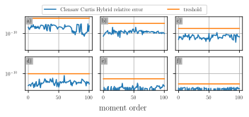
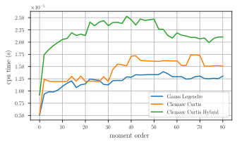
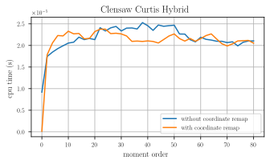

Lightweight Numerical Integration Tools (LNIT)
Some basic tools for numrrical integration

# Integration over infinie/semi-infinite domain

We want to compute the following integral:
$\int_{a}^{\infty} f(x)\mathrm{d}x$ or $\int_{-\infty}^{a} f(x)\mathrm{d}x$.

We can use Gauss-Laguerre quadrature. 
```cpp
const auto f = [mu, sigma, k](const Scalar x) -> Scalar
{
  return std::pow(x, k)*(1 / (sigma*std::sqrt(2*M_PI)))*std::exp(-(x-mu)*(x-mu) / (2*sigma*sigma));
};

LNIT::GaussLaguerreQuadrature<Scalar> quadLaguerre;
quadLaguerre.integrateRightInfinite(f, a); // \f$\int_{a}^{\infty} f(x)\,\mathrm{d}x\f$
quadLaguerre.integrateLeftInfinite(f, a); // \f$\int_{-\infty}^{a} f(x)\,\mathrm{d}x\f$
```
As for now, the Gauss-Laguerre quadrature is only implemented with 33 nodes.

Now if we want to integrate over $\mathbb{R}$, we could simply do
```cpp
const Scalar I = quadLaguerre.integrateRightInfinite(f, a) + quadLaguerre.integrateLeftInfinite(f, a);
```
Or we could use Gauss-Hermite quadrature:
```cpp
LNIT::GaussHermiteQuadrature<Scalar> quadHermite;
const Scalar hermiteEstimated  = quadHermite.integrate(f);
```
As for now, the Gauss-Hermite quadrature is only implemented with 66 nodes.

Since both quadratures integrate over $\mathbb{R}$ with the same number of nodes, we could assume both are equaly accurate.
We compare how both methods integrate the first 40 moments of a Gaussian distribution ($\sigma = 1$ and $\mu = \frac{1}{2}$). 
We show, the relative error committed by both Gauss-Laguerre and Gauss-Hermite quadratures and observe that Gauss-Hermite is much more accurate. 

<p align="center">
  
</p>

This is to be expected as the Gauss-Hermite quadrature is exact for integral of the following kind:
$\int_{\mathbb{R}} \exp(-x^2)p(x)\mathrm{d}x$, where $p$ is a polynomial of order 66.

# Integration over finite domain with addaptive quadrature 

A general strategy for addaptive quadrature over a finite domain $[a,b]$ is to 
```
def integrate(f, a, b, tau):
  I = estimate_integral(f, a, b)
  err = estimate_error(I, f, a, b)
  if err < tau:
    m = (a + b) / 2
    return integrate(f, a, m, tau/2) + integrate(f, m, b, tau/2)
  return I
```
Addaptive quadratures typically use nested quadratures to estimate the integral and the error. 
LNIT Implements three nested quadrature. 
1. A 15 nodes Gauss legrendre with a 14 and 6 nodes non-Gaussian quadratures
2. A nested Clensaw-Curtis with 33, 17 and 9 nodes
3. A 33 nodes Clensaw-Curtis with a 30 nodes non-Gaussian quadrature

Theses quadratures are implemented in the classes `GaussLegendreAdaptiveQuadrature`, `ClensawCurtisAdaptiveQuadrature` and `ClensawCurtisHybridAdaptiveQuadrature`.

Suppose we want to integrate $f(x) = 2 + \sin(3\cos(0.002(x-40)^2))$ with an addaptive Gauss-Legendre method:
```cpp
const auto f = [](const Scalar x) -> Scalar
{
  return 2 + std::sin(3.*std::cos(0.002*(x - 40)*(x - 40)));
};

LNIT::GaussLegendreAdaptiveQuadrature<Scalar> quad;
quad.setTol(1.0e-11); //
const Scalar integral  = quad.integrate(mf_k);
```

# Addaptive quadratures over an infinite interval

Addaptives quadratures cannnot be directly used to integrate over $\mathbb{R}$. However, one can:
1. Use an addaptive quadrature over $[-1, 1]$ and perform a change of variable e.g. $x(t) = \frac{t}{1 - t^2}$
2. Use a Gauss-Legendre quadrature to find $a$ (resp. $b$) such that $\int_{-\inf}^{a} f(x)\mathrm{d}x \approx 0$ (resp. $\int_{b}^{\inf} f(x)\mathrm{d}x \approx 0$) and then use an addaptive quadrature over $[a,b]$.

All addaptive quadrature implements an `remapAndIntegrate` method that implements the change of variable technique and a `integrate` method that uses the second approach.

## Comparaison of the different quadratures.

First, we compare the accuracy of the three quadratures introduced in the above section. In the present section, we are going to integrate over $\mathbb{R}$ using the second approach i.e. we find an interval $[a,b]$ such that $\int_{a}^{b} f(x)\mathrm{d}x \approx \int_{\mathbb{R}} f(x)\mathrm{d}x.$

We compute the first 100 moments of a Gaussian distribution ($\sigma = 1$ and $\mu = \frac{1}{2}$) for various tolerences $10^{-4}$, $10^{-6}$, $10^{-8}$, $10^{-10}$, $10^{-12}$ and $10^{-14}$. 
and display the actual relative error commited by the quadrature and the prescribed thershold.
<p align="center">
  
</p>
<p align="center">
  
</p>
<p align="center">
  
</p>
We see that the "Hybrid" Clensaw-Curstis (i.e. 33 nodes Clensaw-Curtis with a 30 nodes non-Gaussian quadrature) is the most reliable quadrature as the relative error rarelly grows larger than the prescibed treshold.
This means the "Hybrid" Clensaw-Curstis has the most pesimistic error estimate.

We now compare the speed of the three methods on the same example with a treshold of $10^{-11}$.
<p align="center">
  
</p>
We see that the Gauss-Legrendre addaptive quadrature is the fastest. This is to be expected as it has roughly the same accuracy as the 33 nodes Clensaw-Curstis with less Nodes.
The "Hybrid" Clensaw-Curtis is the slower method. This is to be expected because a) it uses more nodes 33 + 30 vs 33+17+9 vs 15+14+6 and b) its more pesimistic error estimate pushes it to subdivide the integration domain more.

If we need speed, the Gauss-Legrendre addaptive quadrature is the best. If we want precision, the "Hybrid" Clensaw-Curtis is the best. The nested Clensaw-Curtis represents a middle ground between speed and acuracy. 

## Comparaison of the different integration method over an infinite interval.

We now compare the two approaches to integrate over an infinite interval. 
We compute the first 100 moments of a Gaussian distribution ($\sigma = 1$ and $\mu = \frac{1}{2}$) with the "Hybrid" Clensaw-Curtis as it is the more accurate.
<p align="center">
  
</p>
For the lower modes, the second appraoch is the fastest. Conversly, for the higer modes, the "remap" approach is the fastest.
